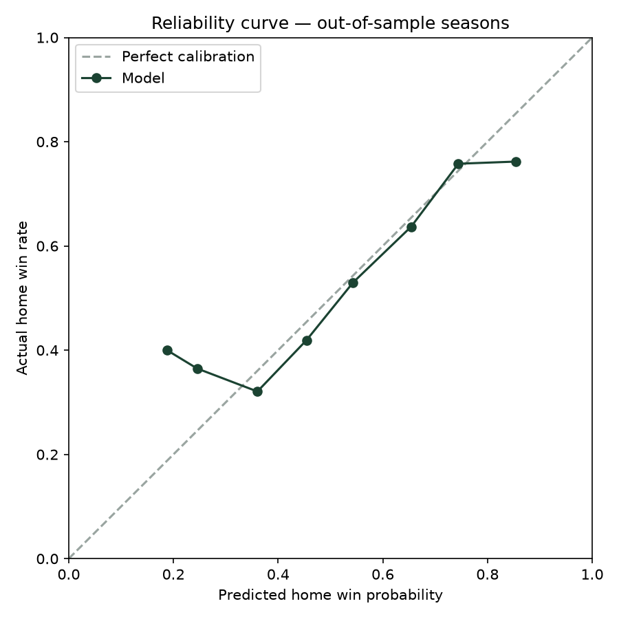

# Backtest — walk-forward by season

Model trains only on seasons before each holdout season; the market
baseline uses de-vigged closing moneyline probabilities (nflverse).

| Season | Games | Model Brier | Vegas Brier | Model LogLoss | Vegas LogLoss | Model Acc | Vegas Acc | Model AUC | Vegas AUC |
|---|---|---|---|---|---|---|---|---|---|
| 2023 | 285 | 0.2415 | 0.2186 | 0.6841 | 0.6270 | 0.604 | 0.677 | 0.635 | 0.691 |
| 2024 | 285 | 0.2099 | 0.2010 | 0.6099 | 0.5892 | 0.691 | 0.705 | 0.753 | 0.757 |
| 2025 | 285 | 0.2173 | 0.2104 | 0.6229 | 0.6059 | 0.656 | 0.663 | 0.705 | 0.725 |
| **All** | 855 | **0.2229** | **0.2100** | 0.6390 | 0.6074 | 0.650 | 0.682 | 0.691 | 0.725 |

