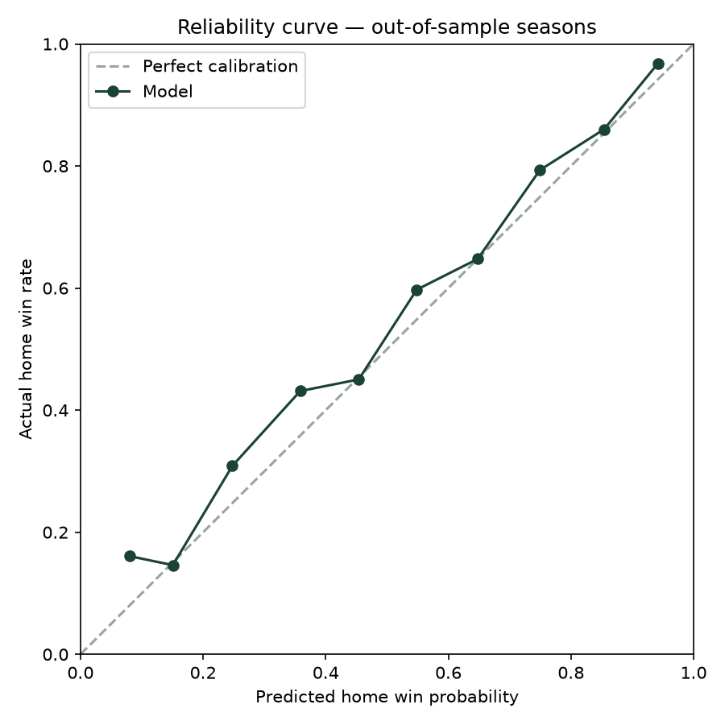

# CFB Backtest — walk-forward by season

Model trains only on seasons before each holdout season; the market
baseline uses de-vigged CFBD closing lines. The model trains on
FBS-vs-FBS and FBS-vs-FCS games, but the calibrator and all metrics
below are FBS-vs-FBS only: mismatch outcomes are near-deterministic
and would inflate apparent reliability in the competitive range.

| Season | Games | Model Brier | Vegas Brier | Model LogLoss | Vegas LogLoss | Model Acc | Vegas Acc | Model AUC | Vegas AUC |
|---|---|---|---|---|---|---|---|---|---|
| 2023 | 755 | 0.1805 | 0.1685 | 0.5347 | 0.5051 | 0.711 | 0.739 | 0.803 | 0.823 |
| 2024 | 757 | 0.1840 | 0.1781 | 0.5450 | 0.5267 | 0.721 | 0.727 | 0.791 | 0.803 |
| 2025 | 763 | 0.1751 | 0.1719 | 0.5198 | 0.5117 | 0.739 | 0.748 | 0.806 | 0.815 |
| **All** | 2275 | **0.1799** | **0.1729** | 0.5331 | 0.5145 | 0.724 | 0.738 | 0.798 | 0.813 |

