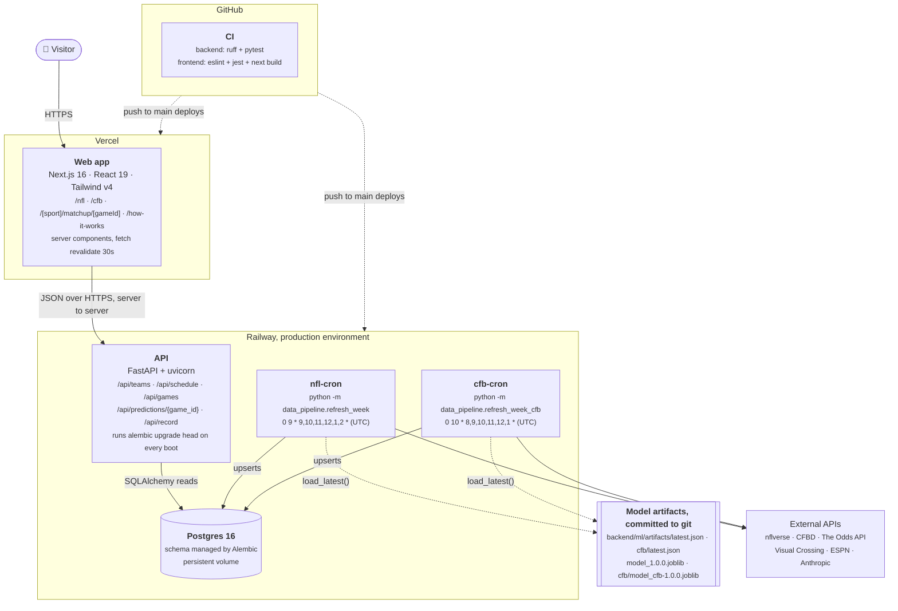

# C4 Level 2: Containers

The deployable and runnable pieces, where each one runs, and how they depend on each other.
"Container" is meant in the C4 sense (a separately running unit), not a Docker container.

**One codebase, three Railway services.** The API and both cron jobs build from the same
`backend/` directory with the same pinned dependencies; they differ only in start command. The
API's comes from `railway.json`; each cron's comes from its own `railway-*-cron.json`, alongside
its schedule. Cron schedules are UTC and list months explicitly because standard cron has no
range that wraps from December into January.

**The API never loads the model.** From `ml/` it imports only `market_home_prob()` (to grade the
market side of the season record). Model artifacts are loaded by `predict_week`, which only the
cron jobs run. See [`prediction-request-sequence.md`](prediction-request-sequence.md).

**Why the model files are in git:** `ml/train.py` pins no random seed, so a retrain on a deploy
target wouldn't reproduce the weights behind the published accuracy numbers. See "Committing the
trained model artifacts, as an exception" in [`DECISIONS.md`](../DECISIONS.md).

**Deploys follow `main`; CI gates PRs.** Vercel and Railway each deploy on a push to `main`
through their own GitHub integrations. CI runs on every PR and on pushes to `main`, but it's a
merge gate, not a deploy trigger.

---
_Last updated: 2026-09-14 · reflects v1.0.10_
