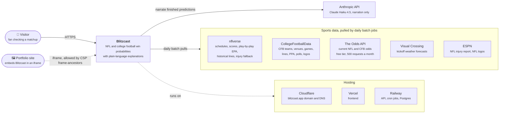

# C4 Level 1: System context

Blitzcast as a single box: the people and systems around it, and which direction data flows.

**Only two things reach Blitzcast in real time:** visitors, and the portfolio site that frames
it. Every data provider sits on the batch side and is called by scheduled jobs, so each free
tier's budget is set by the cron schedule, not by how many people visit.

**Anthropic is a dependency, not an authority.** It receives a finished probability and its top
factors and returns prose. It has no way to change a number, and if it's down (or its output
fails a guardrail) predictions still ship, just without narration. See
[`llm-narration-boundary.md`](llm-narration-boundary.md).

**ESPN shows up for two unrelated reasons:** the NFL injury refresh reads ESPN's unofficial
injuries endpoint (falling back to nflverse if it fails), and NFL team logos come from ESPN's
CDN. CFB logos come from CollegeFootballData instead.

---
_Last updated: 2026-09-14 · reflects v1.0.10_
