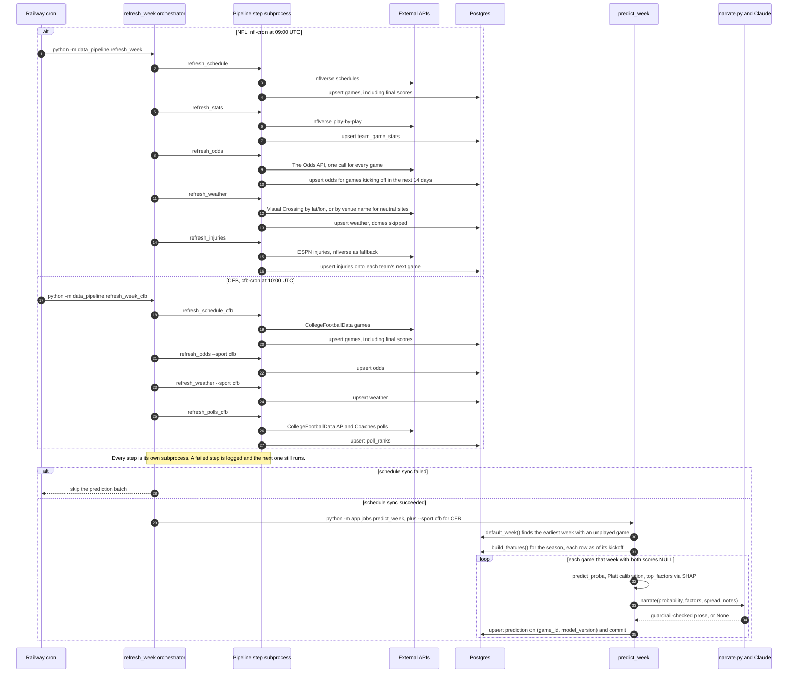

# Sequence diagram: the daily refresh

What each Railway cron service runs every morning in season: pull fresh data, then generate and
narrate predictions for the current week. NFL and CFB run the same shape with different steps.

**Soft-fail by design.** The orchestrator runs each step with `subprocess.run(..., check=False)`
and keeps going when one fails: stale weather is better than no predictions. The one hard
dependency is the schedule sync, because predicting against an out-of-date schedule could target
the wrong week or re-predict a game that has already finished.

**Idempotent and resumable.** Every loader upserts on a natural key, and `predict_week` commits
after each game, so a crash halfway through a ~100-game CFB slate keeps what finished and a
re-run simply overwrites the same rows.

**Free-tier budgets are set here, not by traffic.** The Odds API is called once per sport per day
(about 60 calls a month when both seasons overlap). Each call requests three markets, and The
Odds API bills markets × regions, so that is roughly 180 of the 500 monthly credits;
`refresh_odds` logs the remaining quota after every run. Visual Crossing stays under 1,000
records a day even with CFB's 8-day window. See "Odds API: one batch call per day, never per request" in
[`DECISIONS.md`](../DECISIONS.md).

**Schedules are UTC and season-scoped:** `0 9 * 9,10,11,12,1,2 *` (NFL) and
`0 10 * 8,9,10,11,12,1 *` (CFB), with months listed because cron can't express a range that wraps
into January. Outside those months the jobs simply don't fire.

---
_Last updated: 2026-09-14 · reflects v1.0.11_
