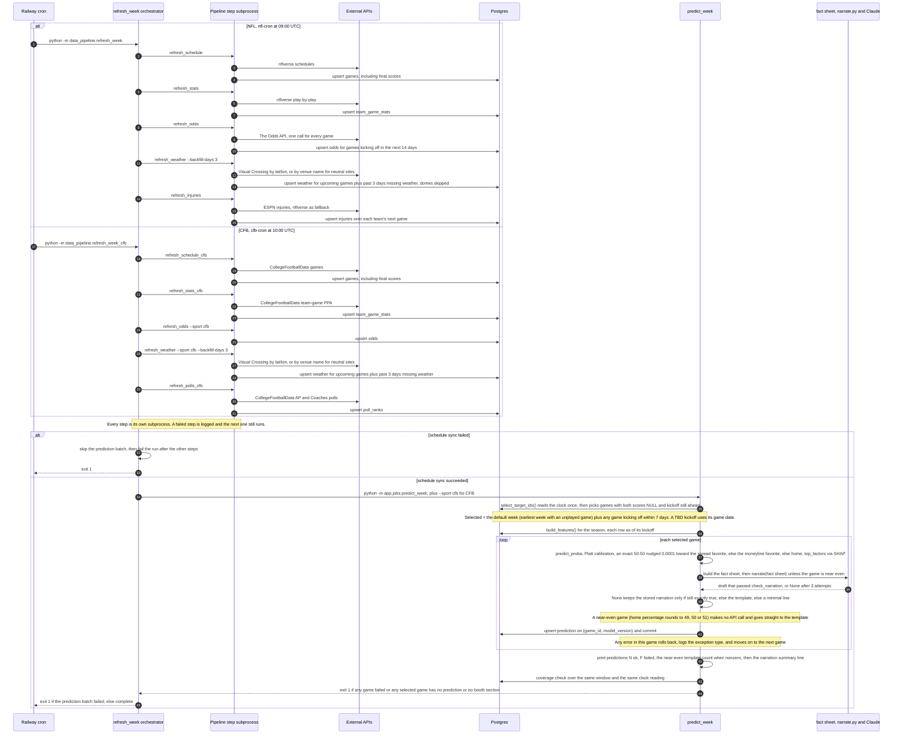

# Sequence diagram: the daily refresh

What each Railway cron service runs every morning in season: pull fresh data, then generate and
narrate predictions for the current week and the next seven days. NFL and CFB run the same shape with different steps.

```mermaid
sequenceDiagram
    autonumber
    participant R as Railway cron
    participant O as refresh_week orchestrator
    participant P as Pipeline step subprocess
    participant X as External APIs
    participant DB as Postgres
    participant J as predict_week
    participant L as fact sheet, narrate.py and Claude

    alt NFL, nfl-cron at 09:00 UTC
        R->>O: python -m data_pipeline.refresh_week
        O->>P: refresh_schedule
        P->>X: nflverse schedules
        P->>DB: upsert games, including final scores
        O->>P: refresh_stats
        P->>X: nflverse play-by-play
        P->>DB: upsert team_game_stats
        O->>P: refresh_odds
        P->>X: The Odds API, one call for every game
        P->>DB: upsert odds for games kicking off in the next 14 days
        O->>P: refresh_weather --backfill-days 3
        P->>X: Visual Crossing by lat/lon, or by venue name for neutral sites
        P->>DB: upsert weather for upcoming games plus past 3 days missing weather, domes skipped
        O->>P: refresh_injuries
        P->>X: ESPN injuries, nflverse as fallback
        P->>DB: upsert injuries onto each team's next game
    else CFB, cfb-cron at 10:00 UTC
        R->>O: python -m data_pipeline.refresh_week_cfb
        O->>P: refresh_schedule_cfb
        P->>X: CollegeFootballData games
        P->>DB: upsert games, including final scores
        O->>P: refresh_stats_cfb
        P->>X: CollegeFootballData team-game PPA
        P->>DB: upsert team_game_stats
        O->>P: refresh_odds --sport cfb
        P->>DB: upsert odds
        O->>P: refresh_weather --sport cfb --backfill-days 3
        P->>X: Visual Crossing by lat/lon, or by venue name for neutral sites
        P->>DB: upsert weather for upcoming games plus past 3 days missing weather
        O->>P: refresh_polls_cfb
        P->>X: CollegeFootballData AP and Coaches polls
        P->>DB: upsert poll_ranks
    end
    Note over O,P: Every step is its own subprocess. A failed step is logged and the next one still runs.
    alt schedule sync failed
        O->>O: skip the prediction batch, then fail the run after the other steps
        O-->>R: exit 1
    else schedule sync succeeded
        O->>J: python -m app.jobs.predict_week, plus --sport cfb for CFB
        J->>DB: select_target_ids() reads the clock once, then picks games with both scores NULL and kickoff still ahead
        Note over J,DB: Selected = the default week (earliest week with an unplayed game) plus any game kicking off within 7 days. A TBD kickoff uses its game date.
        J->>DB: build_features() for the season, each row as of its kickoff
        loop each selected game
            J->>J: predict_proba, Platt calibration, an exact 50-50 nudged 0.0001 toward the spread favorite, else the moneyline favorite, else home, top_factors via SHAP
            J->>L: build the fact sheet, then narrate(fact sheet) unless the game is near even
            L-->>J: draft that passed check_narration, or None after 3 attempts
            J->>J: None keeps the stored narration only if still exactly true, else the template, else a minimal line
            Note over J: A near-even game (home percentage rounds to 49, 50 or 51) makes no API call and goes straight to the template
            J->>DB: upsert prediction on (game_id, model_version) and commit
            Note over J: Any error in this game rolls back, logs the exception type, and moves on to the next game
        end
        J->>J: print predictions N ok, F failed, the near-even template count when nonzero, then the narration summary line
        J->>DB: coverage check over the same window and the same clock reading
        J-->>O: exit 1 if any game failed or any selected game has no prediction or no booth section
        O-->>R: exit 1 if the prediction batch failed, else complete
    end
```

**Soft-fail by design.** The orchestrator runs each step with `subprocess.run(..., check=False)`
and keeps going when one fails: stale weather is better than no predictions. The one hard
dependency is the schedule sync, because predicting against an out-of-date schedule could target
the wrong week or re-predict a game that has already finished. Only the prediction batch can fail
the run itself, and only after every other step has run.

**Look-ahead window.** `predict_week` without `--week` predicts the default week plus every
unplayed game kicking off within `LOOKAHEAD_DAYS` (7) of the run's single clock reading, so a
game has a prediction and booth section once the game kicks off within seven days (or is in the
current week), not only on the morning of its first game. A game whose kickoff has passed is
never selected, and a TBD-kickoff game leaves the window 36 hours after its game date
(`STALE_AFTER`). Daily reruns refresh the early
predictions. `--week N` still predicts only that week. An early CFB game written before the weekly
AP poll is out lacks the poll rank line until the next daily run.

**Failure is isolated per game, and the run is loud.** Each game is predicted, narrated and
committed inside its own guard, so one failing game is rolled back, logged by exception type, and
counted while the rest of the slate runs. The job then runs a read-only coverage check
(`python -m app.jobs.coverage` runs the same check alone) and exits 1 when any game failed, any
selected game has no prediction or no booth section, or no selected game produced a feature row.
The orchestrators still run every step first, then exit 1 if the prediction batch failed or was
skipped for a failed schedule sync, so the cron run shows as failed instead of a silent gap.

**Weather back-fills and fails loudly.** Both crons pass `--backfill-days 3`, so a game whose
weather was missed on an earlier day is picked up again instead of staying empty. A weather run
where every attempted call fails exits 1, and a missing `VISUAL_CROSSING_API_KEY` prints a
`WARNING:`. Because the orchestrator ignores the exit codes of every step but the prediction batch, either one
shows in the cron logs only and the next step still runs.

**CFB form data comes from this cron.** `refresh_stats_cfb` re-ingests the season's team-game PPA
(one CFBD call a day) into `team_game_stats`, which feeds the rolling EPA form features. It skips
until the season has a final game. CFB turnovers and yards stay NULL, since CFBD PPA has neither.

**A narration never costs a prediction.** Each game's fact sheet and narration are built inside a
guard, so an error there still writes the prediction. The chain is a fresh AI draft, then the
stored narration only if it is still exactly true today (`still_true`), then the deterministic
template, then a minimal model-only line when even the fact sheet cannot be built. A near-even
game (`is_near_even`: the home percentage rounds to 49, 50 or 51) skips the AI draft and the kept
step and goes straight to the template, which always names the pick. The run ends with
`narration: N written, K kept, F fallback, L minimal, J none`, preceded by
`narration: near-even games written from the template by design: N` when any were, plus a
`WARNING:` line when any game has none. See [`llm-narration-boundary.md`](llm-narration-boundary.md).

**Idempotent and resumable.** Every loader upserts on a natural key, and `predict_week` commits
after each game, so a crash halfway through a ~100-game CFB slate keeps what finished and a
re-run simply overwrites the same rows.

**Free-tier budgets are set here, not by traffic.** The Odds API is called once per sport per day
(about 60 calls a month when both seasons overlap). Each call requests three markets, and The
Odds API bills markets × regions, so that is roughly 180 of the 500 monthly credits;
`refresh_odds` logs the remaining quota after every run. Visual Crossing stays under 1,000
records a day even with CFB's 8-day window. See "Odds API: one batch call per day, never per request" in
[`DECISIONS.md`](../DECISIONS.md).

**Schedules are UTC and season-scoped:** `0 9 * 9,10,11,12,1,2 *` (NFL) and
`0 10 * 8,9,10,11,12,1 *` (CFB), with months listed because cron can't express a range that wraps
into January. Outside those months the jobs simply don't fire.

---
_Last updated: 2026-10-06 · reflects v1.1.3_
