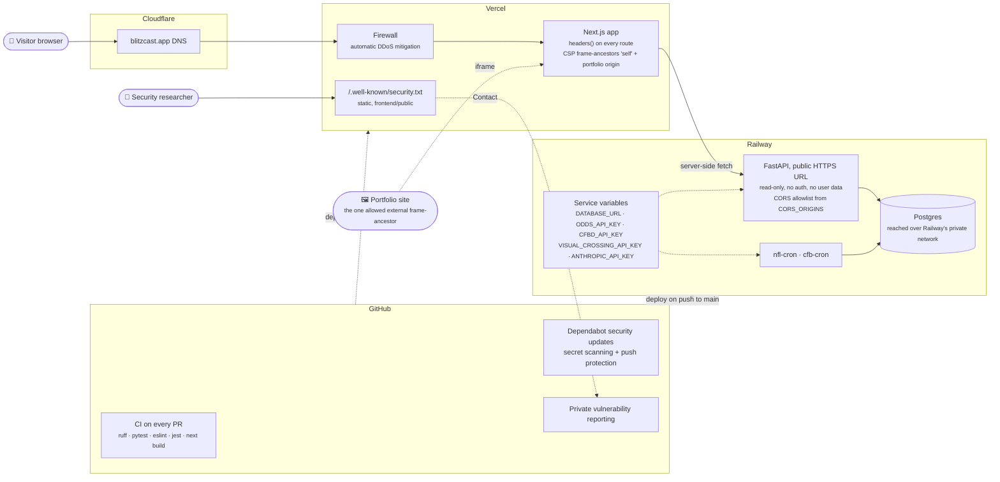

# Deployment and security

How a request reaches the app, where each trust boundary sits, and which control protects each
hop. Blitzcast stores no accounts or personal data, so the realistic risks are clickjacking,
leaked API keys, dependency vulnerabilities, and availability.

**The intermittent 503s were this firewall, not the backend.** Next.js prefetches every visible
link by default, and a slate page renders dozens at once (week selector, game cards, filters), so
simply loading a page fired a burst that Vercel's DDoS mitigation read as an attack. Railway showed
a 0% error rate throughout. The fix removed the burst at the source with `prefetch={false}` on
every bulk-rendered link list. See "Root-caused the intermittent 503s" in
[`DECISIONS.md`](../DECISIONS.md).

**Framing is allowed in exactly two places:** blitzcast.app itself and the maintainer's portfolio
site. That's done with CSP `frame-ancestors` alone; `X-Frame-Options` can't list more than one
origin and is overridden by `frame-ancestors` wherever both are supported.

**The browser never calls Railway.** Every API call happens server-to-server from Vercel, so CORS
is a backstop rather than the main control. The API is publicly reachable, but it's read-only,
unauthenticated by design, and serves nothing the website doesn't already show.

**Secrets never touch the repo.** Keys live in Vercel and Railway service variables and in
gitignored `.env` files (only `.env.example` is committed). GitHub secret scanning with push
protection is on, and every job degrades gracefully when a key is missing. Dependabot security
updates are enabled, but its PRs are applied by hand on a regular branch rather than merged
directly.

**`security.txt` expires on 2027-09-14** and must be renewed before then (noted in
[`SECURITY.md`](../SECURITY.md)).

---
_Last updated: 2026-09-14 · reflects v1.0.10_
