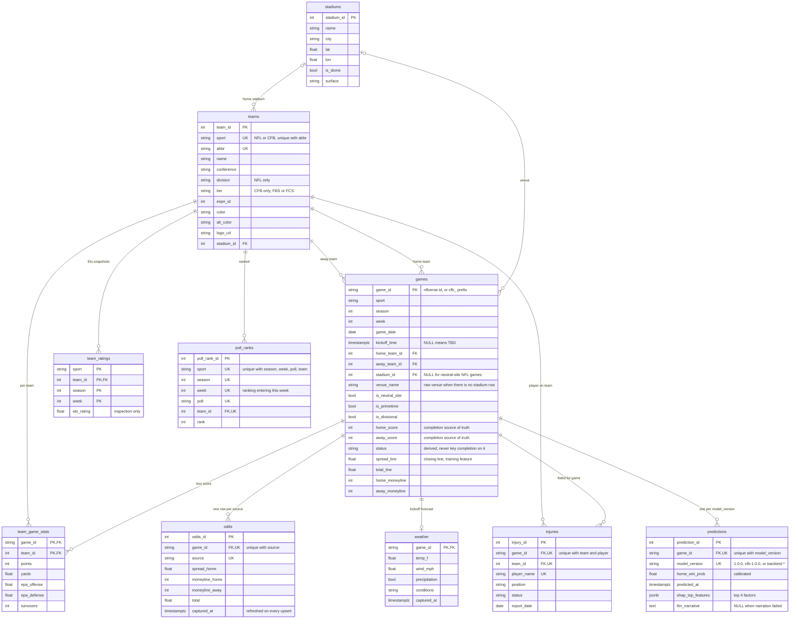

# ER diagram: the Postgres schema

All ten tables from `backend/app/models.py` (managed by the three Alembic migrations in
`backend/alembic/versions/`). NFL and CFB share every table, separated by a `sport` column
rather than a second schema.

**Completion lives in two nullable columns, not in `status`.** A game is over when
`home_score` and `away_score` are both present, checked directly at every call site: the
`?status=` filter, the verdict badge, the season record. `status` is derived and unindexed, and
the NFL loader still sets it from the home score alone. See "Completion keyed on scores,
never on `Game.status`" in [`DECISIONS.md`](../DECISIONS.md).

**`predictions` is unique on `(game_id, model_version)`, and that constraint does real work.**
Live rows carry `1.0.0` / `cfb-1.0.0`; walk-forward reconstructions of 2023-2025 carry
`backtest-1.0.0` / `backtest-cfb-1.0.0`. The slate's probability and `/api/record` both filter
`model_version NOT LIKE 'backtest%'`, so reconstructed history can never pose as a live call.
The matchup page is the one reader that takes the newest row of any version, and it labels a
reconstructed row as such. Re-running `predict_week` updates the same row rather than adding one.

**`odds` is a snapshot, not a history.** There is one row per `(game_id, source)`, overwritten
by each daily refresh with a fresh `captured_at`. Readers take the newest row; when a game has
none (every historical game), the matchup page falls back to the closing lines stored on `games`.

**`team_ratings` isn't on any serving path.** `ml.compute_ratings` writes Elo snapshots for
inspection; `ml/features.py` replays Elo from game results itself whenever it builds features.
CFB has no rows in `injuries` (there is no standardized CFB injury report), and NFL has none in
`poll_ranks`.

---
_Last updated: 2026-09-14 · reflects v1.0.11_
