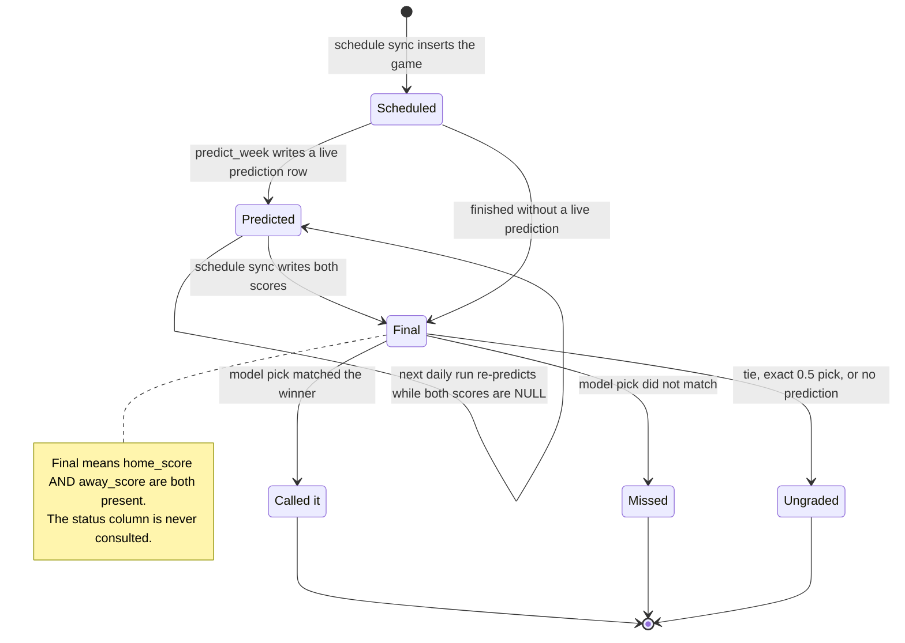

# State diagram: a game's lifecycle

What a single game goes through, from appearing on the schedule to being graded on the
season record, and which data decides each transition.

**Grading is one function, `prediction_verdict()`** in `backend/app/services/predictions.py`. It
returns nothing to grade when there's no prediction, either score is missing, the game tied, or
the probability is exactly 0.5; otherwise it compares the side the model favored with the side
that won. The same function drives the "Called it" / "Missed" badge on the slate and matchup page.

**The season record is stricter than the badge.** `/api/record` only counts a game when the
*market* can be graded the same way (a market probability exists, de-vigged from moneylines or
derived from the spread when they're missing, and isn't exactly 0.5), and it ignores `backtest-*` rows entirely, so the model and the market are always compared
on an identical set of games. See "Record always paired with the market baseline" in
[`DECISIONS.md`](../DECISIONS.md).

**Which week gets predicted:** `default_week()` picks the earliest week that still has a game
with no scores, but treats a week as done 36 hours after the latest kickoff among its
still-unscored games, so a cancelled game can't pin the daily job to an old week forever.

**Kickoff-gated, not just score-gated.** "Unplayed" isn't only "both scores are NULL":
`unplayed_game_ids()` also excludes a game once its kickoff has passed, even with no score yet.
Without that, a game already underway (or one whose final score simply hasn't landed from the
data source yet) would get silently re-predicted on the next cron, with a `predicted_at` that
lies about when the call was actually made, even though the inputs are unchanged (there's no
live/in-progress data to leak in). A NULL kickoff is a still-TBD future game and stays eligible
regardless of `now`, matching how `default_week` already treats it.

---
_Last updated: 2026-09-14 · reflects v1.0.11_
