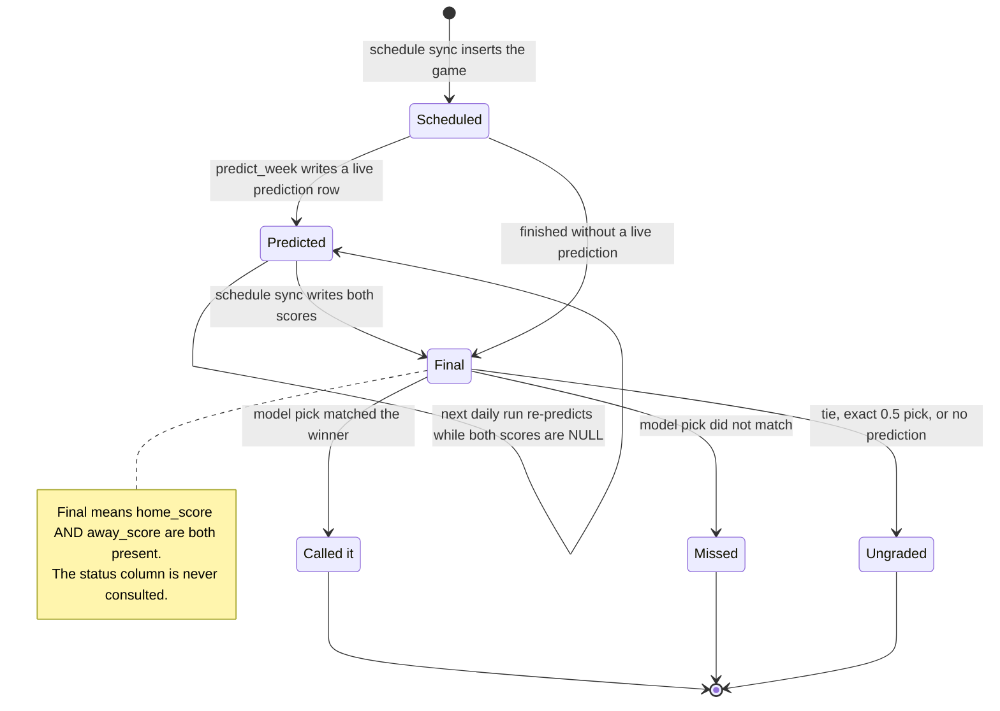

# State diagram: a game's lifecycle

What a single game goes through, from appearing on the schedule to being graded on the
season record, and which data decides each transition.

**Grading is one function, `prediction_verdict()`** in `backend/app/services/predictions.py`. It
returns nothing to grade when there's no prediction, either score is missing, the game tied, or
the probability is exactly 0.5; otherwise it compares the side the model favored with the side
that won. The same function drives the "Called it" / "Missed" badge on the slate and matchup page.

**The season record is stricter than the badge.** `/api/record` only counts a game when the
*market* can be graded the same way (a de-vigged market probability exists and isn't exactly
0.5), and it ignores `backtest-*` rows entirely, so the model and the market are always compared
on an identical set of games. See "Record always paired with the market baseline" in
[`DECISIONS.md`](../DECISIONS.md).

**Which week gets predicted:** `default_week()` picks the earliest week that still has a game
with no scores, but treats a week as done 36 hours after its last kickoff, so a cancelled game
can't pin the daily job to an old week forever.

**Known edge, tracked separately:** "unplayed" means both scores are NULL, so a game already in
progress when a cron runs is re-predicted. Its inputs don't change (the odds refresh only captures
lines for games that haven't kicked off), but `predicted_at` is re-stamped after kickoff.

---
_Last updated: 2026-09-14 · reflects v1.0.10_
