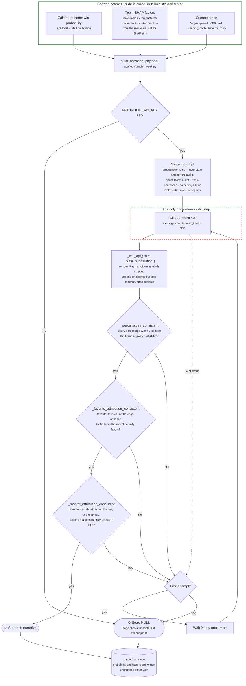

# The LLM narration boundary

Claude writes the broadcaster-style explanation on every matchup page. It never produces or
changes a number. This diagram shows where that line sits and the checks
`backend/app/services/narrate.py` runs before any generated text is stored.

**Why the line is here:** keeping the prediction deterministic and testable is the whole point of
using a real, backtested model. If a language model could touch the number, the walk-forward
results would describe something other than what visitors see. See "LLM narration layer strictly
downstream of the model, never upstream" in [`DECISIONS.md`](../DECISIONS.md).

**A failed narration costs prose, never a prediction.** At most two API calls per game; any
failure, including a missing key, stores `NULL` and the page falls back to the factor list. The
probability and factors in the same row are written identically either way.

**Each guardrail exists because of a real production bug.** The percentage check alone passed
narrations that cited the right number while calling the underdog "a slight favorite", so the
favorite-attribution check was added. Then a narration correctly named the model's favorite while
misstating which team *Vegas* favored, which the market check now catches. Market factors' SHAP
direction is also grounded in raw data upstream, for the same reason. See the three narration and
SHAP-direction entries in [`DECISIONS.md`](../DECISIONS.md).

**Known gap (CFB only):** team matching uses every word of a team's stored name plus its
abbreviation. NFL names include the nickname ("Buffalo Bills"), but CFB names are school names,
so a CFB sentence that names a team only by mascot ("the Bruins") isn't checked.

---
_Last updated: 2026-09-14 · reflects v1.0.11_
