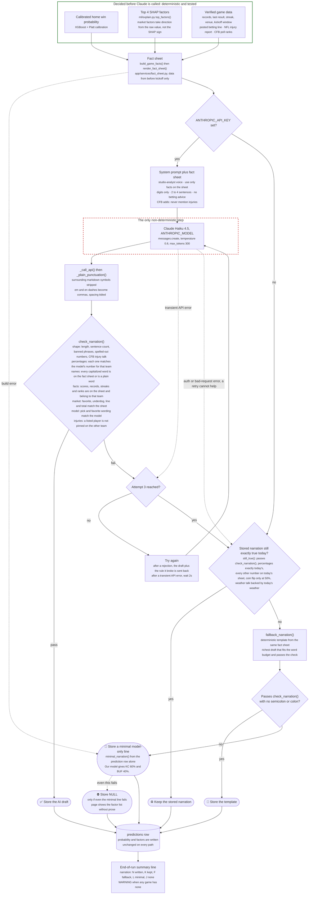

# The LLM narration boundary

Claude writes the broadcaster-style "From the booth" preview on every matchup page. It never
produces or changes a number. This diagram shows where that line sits, the checks
`check_narration` in `backend/app/services/narrate.py` runs on every draft, and what happens when
no draft passes.

```mermaid
flowchart TB
    subgraph fixed["Decided before Claude is called: deterministic and tested"]
        prob["Calibrated home win probability<br/><small>XGBoost + Platt calibration</small>"]
        factors["Top 4 SHAP factors<br/><small>ml/explain.py top_factors()<br/>market factors take direction from the raw value, not the SHAP sign</small>"]
        data["Verified game data<br/><small>records, last result, streak, venue, kickoff window<br/>posted betting line · NFL injury report · CFB poll ranks</small>"]
    end

    sheet["Fact sheet<br/><small>build_game_facts() then render_fact_sheet()<br/>app/services/fact_sheet.py, data from before kickoff only</small>"]
    key{"ANTHROPIC_API_KEY set?"}
    prompt["System prompt plus fact sheet<br/><small>studio-analyst voice · use only facts on the sheet<br/>digits only · 2 to 4 sentences · no betting advice<br/>CFB adds: never mention injuries</small>"]

    subgraph llm["The only non-deterministic step"]
        claude["Claude Haiku 4.5, ANTHROPIC_MODEL<br/><small>messages.create, temperature 0.8, max_tokens 300</small>"]
    end

    clean["_call_api() then _plain_punctuation()<br/><small>surrounding markdown symbols stripped<br/>em and en dashes become commas, spacing tidied</small>"]
    check{"check_narration()<br/><small>shape: length, sentence count, banned phrases, spelled-out numbers, CFB injury talk<br/>percentages: each one matches the model's number for that team<br/>names: every capitalized word is on the fact sheet or is a plain word<br/>facts: scores, records, streaks and ranks are on the sheet and belong to that team<br/>market: favorite, underdog, line and total match the sheet<br/>model: pick and favorite wording match the model<br/>injuries: a listed player is not pinned on the other team</small>"}
    again{"Attempt 3 reached?"}
    wait["Try again<br/><small>after a rejection, the draft plus the rule it broke is sent back<br/>after a transient API error, wait 2s</small>"]
    accept(["✅ Store the AI draft"])

    prev{"Stored narration still exactly true today?<br/><small>still_true(): passes check_narration(), percentages exactly today's,<br/>every other number on today's sheet, coin flip only at 50%,<br/>weather talk backed by today's weather</small>"}
    kept(["♻️ Keep the stored narration"])
    fallback["fallback_narration()<br/><small>deterministic template from the same fact sheet<br/>richest draft that fits the word budget and passes the check</small>"]
    fbcheck{"Passes check_narration()<br/>with no semicolon or colon?"}
    template(["📄 Store the template"])
    minimal(["🔢 Store a minimal model-only line<br/><small>minimal_narration() from the prediction row alone<br/>Our model gives KC 60% and BUF 40%.</small>"])
    none(["⛔ Store NULL<br/><small>only if even the minimal line fails<br/>page shows the factor list without prose</small>"])

    row[("predictions row<br/><small>probability and factors are written<br/>unchanged on every path</small>")]
    summary["End-of-run summary line<br/><small>narration: N written, K kept, F fallback, L minimal, J none<br/>WARNING when any game has none</small>"]

    prob --> sheet
    factors --> sheet
    data --> sheet
    sheet -.->|"build error"| minimal
    sheet --> key
    key -->|yes| prompt --> claude --> clean --> check
    key -->|no| prev
    claude -.->|"transient API error"| again
    claude -.->|"auth or bad-request error, a retry cannot help"| prev
    check -->|pass| accept
    check -->|fail| again
    again -->|no| wait --> claude
    again -->|yes| prev
    prev -->|yes| kept
    prev -->|no| fallback --> fbcheck
    fbcheck -->|yes| template
    fbcheck -->|no| minimal
    minimal -.->|"even this fails"| none
    accept --> row
    kept --> row
    template --> row
    minimal --> row
    none --> row
    row --> summary

    style fixed fill:transparent,stroke:#2E7D32,stroke-width:2px
    style llm fill:transparent,stroke:#C62828,stroke-width:2px,stroke-dasharray: 5 5
```

**Why the line is here:** keeping the prediction deterministic and testable is the whole point of
using a real, backtested model. If a language model could touch the number, the walk-forward
results would describe something other than what visitors see. Claude is handed the probability,
the factors, and a fact sheet, and everything it writes is checked against them. See "LLM
narration layer strictly downstream of the model, never upstream" and "The narrator works from a
fact sheet, not raw SHAP values" in [`DECISIONS.md`](../DECISIONS.md).

**A failed narration costs prose, never a prediction, and rarely even the prose.** Each game gets
at most 3 API calls. If none survives the check, the stored narration is kept only when it is
still exactly true today: today's exact percentages, every other number on today's sheet, and no
weather talk that today's weather does not back. Otherwise a deterministic template built from
the same fact sheet is stored. If the fact sheet cannot be built or the template fails its check,
a minimal model-only line ("Our model gives KC 60% and BUF 40%.") is built from the prediction row
alone, so a matchup does not have an empty booth section. `NULL` is left only if even that line
fails, and the page then shows the factor list. A failure in any step is caught per game, so one bad game never blocks its own prediction
or the rest of the slate. The probability and factors in the row are identical on every path.

**Each rule family exists because of a real bug.** Narrations misread the stored spread sign,
called the underdog "a slight favorite" while citing the right percentage, named players and
venues that were never in the data, and called a window that spans last season "recent form".
The sheet states those facts in words, and the check verifies each claim against it instead of
trusting the model's reading of a number. The rejection reason is fed back on the retry because a
blind second try tends to repeat the mistake. Market factors' SHAP direction is also grounded in
raw data upstream, for the same reason. See the narration and SHAP-direction entries in
[`DECISIONS.md`](../DECISIONS.md).

**Known gaps, by design.** The name check leans strict: a false rejection costs a retry, a false
pass puts a wrong claim on the page. What it still cannot see: a surname that is also a common
word, a pronoun that resolves to the wrong team, a number with no team nearby, whether an injury
is listed Out or Doubtful, and invented history that contains no number. CFB narrations may not
mention injuries at all, since there is no reliable college injury report. An AI draft that
names a Las Vegas venue for a game with no posted line is rejected by the market-talk rule, so
that game gets the template, which leaves the venue out. Extreme mismatches can read 100% and 0%,
consistent with the page's own whole-number rounding.

---
_Last updated: 2026-10-02 · reflects v1.1.0_
