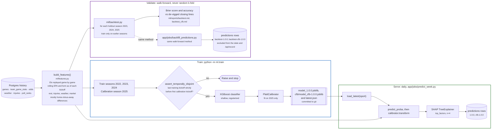

# ML pipeline: train, validate, serve

Three separate paths share one feature builder. Training produces the committed artifact,
validation measures it honestly against the betting market, and serving applies it daily. Each
sport (NFL, CFB) runs the same shape with its own Elo configuration, model, and calibration.

**The leakage rule is a tested property, not a convention.** Every feature for a game is computed
only from data strictly before that game's kickoff, and a dedicated test enforces it.
`assert_temporally_disjoint` adds a second guard at training time, so that if the training window
is ever widened, an overlap with the calibration season fails loudly instead of leaking. See
"Anti-leakage as an explicit, tested property" and "No mid-season retrain" in
[`DECISIONS.md`](../DECISIONS.md).

**Validation compares against the market, not just a hit rate.** A bare accuracy number says
little; the backtest reports Brier score and accuracy next to the de-vigged closing line over the
same games, and the model lands close to the line without beating it. The README's backtest
tables come from here.

**Backfilled history is labeled so it can't flatter the model.** The shipped model trained on
2023-2025, so scoring it on those seasons would be in-sample. `backfill_predictions` instead
reuses the walk-forward models and writes them under `backtest-*` versions that the live record
ignores. See "Backfilled predictions from walk-forward retraining, not the shipped model".

**Calibration is first-class:** tree ensembles tend to be overconfident, so raw scores are Platt
calibrated on a held-out, most-recent season before a "70%" is ever shown to anyone.

---
_Last updated: 2026-09-14 · reflects v1.0.10_
