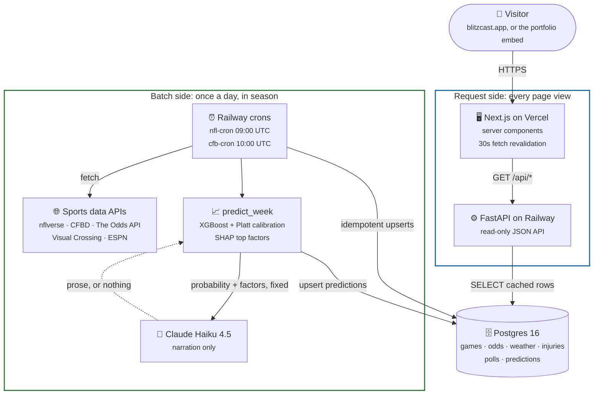

# Overview: the whole system in one diagram

Start here. Blitzcast is two halves that only meet in the database: a request side that serves
pages, and a batch side that does all the actual work once a day. Every box below is expanded
in its own diagram (see the table at the bottom).

**The one thing to take away:** a page view never runs the model, never calls Claude, and never
touches a rate-limited API. It reads rows the batch side already wrote. That single decision is
why site traffic can't burn through The Odds API's 500 requests a month, and why a slow or failed
Claude call can't slow a page down (see "Batch-generated predictions, not per-request inference"
in [`DECISIONS.md`](../DECISIONS.md)).

**The model and the LLM are deliberately in a line, not side by side.** The model decides the
probability; Claude only receives it, already fixed, and turns it into prose. The dotted arrow
back is the whole of Claude's influence: text, or nothing at all.

## Go deeper

| Question | Diagram |
| --- | --- |
| Who uses the system, and what does it depend on? | [`c4-context.md`](c4-context.md) |
| What are the deployable pieces? | [`c4-container.md`](c4-container.md) |
| What does the database look like? | [`er-diagram.md`](er-diagram.md) |
| What happens when a matchup page loads? | [`prediction-request-sequence.md`](prediction-request-sequence.md) |
| What do the daily cron jobs do? | [`daily-refresh-sequence.md`](daily-refresh-sequence.md) |
| How is Claude kept from touching the numbers? | [`llm-narration-boundary.md`](llm-narration-boundary.md) |
| How is the model trained, validated, and served? | [`ml-pipeline.md`](ml-pipeline.md) |
| How does a game go from scheduled to "Called it"? | [`game-lifecycle-state.md`](game-lifecycle-state.md) |
| How is it hosted and secured? | [`deployment-security.md`](deployment-security.md) |

---
_Last updated: 2026-09-14 · reflects v1.0.10_
