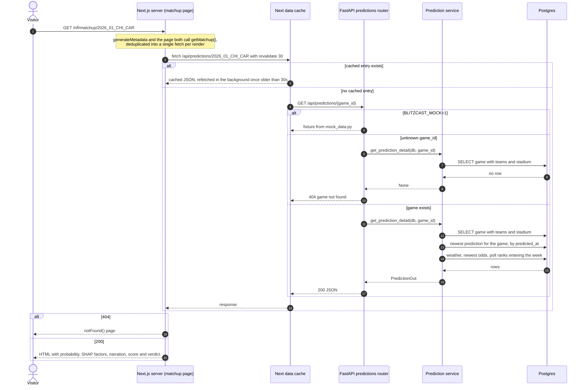

# Sequence diagram: loading a matchup page

What happens between a visitor opening `/nfl/matchup/2026_01_CHI_CAR` and the page rendering.
The important part is what's missing: no model, no Claude call, no external API.

**Nothing is computed per request.** The probability, factors, and narration were written by the
daily batch (see [`daily-refresh-sequence.md`](daily-refresh-sequence.md)); this path is reads
only. See "Batch-generated predictions, not per-request inference" in
[`DECISIONS.md`](../DECISIONS.md).

**A game with no prediction yet still renders.** The service returns
`prediction_status: "pending"` with an empty factor list, so a newly scheduled game gets a real
page instead of an error.

**Why a 30-second cache and not `no-store`:** predictions change once a day, so a live
Vercel-to-Railway-to-Postgres round trip on every click bought no freshness and cost noticeable
latency on mobile. See "Short revalidation window over `no-store`" in
[`DECISIONS.md`](../DECISIONS.md).

**Two details worth knowing:** this read takes the newest prediction of *any* `model_version`
(the slate and `/api/record` exclude `backtest-*` rows; the matchup page instead shows a
reconstructed row with a label). And if Railway is unreachable, `api.ts` throws
`ApiUnreachableError`, which the page catches to render its `BackendDown` state (metadata falls
back to a plain "Matchup" title); `src/app/error.tsx` only handles other, unexpected errors.

---
_Last updated: 2026-09-14 · reflects v1.0.10_
